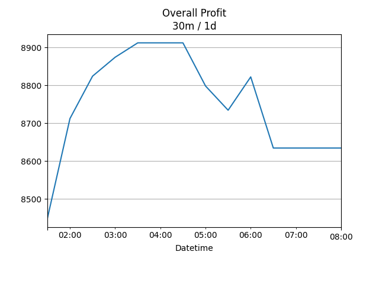

## Net Profit [📈]:
### $7952.60
|type|graph|data|
|:---:|:---:|:---:|
|30m / 1d||<table border="1" class="dataframe"> <thead> <tr style="text-align: center;"> <th>Datetime</th> <th>profit</th> </tr> </thead> <tbody> <tr> <td>01:30</td> <td>7568.6</td> </tr> <tr> <td>02:00</td> <td>8006.6</td> </tr> <tr> <td>02:30</td> <td>7826.6</td> </tr> <tr> <td>03:00</td> <td>7884.6</td> </tr> <tr> <td>03:30</td> <td>7884.6</td> </tr> <tr> <td>04:00</td> <td>7884.6</td> </tr> <tr> <td>04:30</td> <td>7884.6</td> </tr> <tr> <td>05:00</td> <td>7952.6</td> </tr> </tbody></table>|
|1d / 5d||<table border="1" class="dataframe"> <thead> <tr style="text-align: center;"> <th>Date</th> <th>profit</th> </tr> </thead> <tbody> <tr> <td>2025-11-20</td> <td>6232.6</td> </tr> <tr> <td>2025-11-23</td> <td>6972.6</td> </tr> <tr> <td>2025-11-24</td> <td>7176.6</td> </tr> <tr> <td>2025-11-25</td> <td>7342.6</td> </tr> <tr> <td>2025-11-26</td> <td>7952.6</td> </tr> </tbody></table>|
|1wk / 1mo||<table border="1" class="dataframe"> <thead> <tr style="text-align: center;"> <th>Date</th> <th>profit</th> </tr> </thead> <tbody> <tr> <td>2025-10-26</td> <td>4384.6</td> </tr> <tr> <td>2025-11-02</td> <td>6672.6</td> </tr> <tr> <td>2025-11-09</td> <td>8094.6</td> </tr> <tr> <td>2025-11-16</td> <td>6232.6</td> </tr> <tr> <td>2025-11-23</td> <td>7922.6</td> </tr> </tbody></table>|
---
## 002100.SZ [📉] [$-2937.40] [-9.71%]:
#### TECON BIOLOGY Co.LTD
|price|profit|data|
|:---:|:---:|:---:|
|||<table border="1" class="dataframe"> <thead> <tr style="text-align: center;"> <th>Datetime</th> <th>profit</th> </tr> </thead> <tbody> <tr> <td>09:30</td> <td>-3051.4</td> </tr> <tr> <td>10:00</td> <td>-2823.4</td> </tr> <tr> <td>10:30</td> <td>-2823.4</td> </tr> <tr> <td>11:00</td> <td>-2975.4</td> </tr> <tr> <td>11:30</td> <td>-2975.4</td> </tr> <tr> <td>12:00</td> <td>-2975.4</td> </tr> <tr> <td>12:30</td> <td>-2975.4</td> </tr> <tr> <td>13:00</td> <td>-2937.4</td> </tr> </tbody></table>|
|||<table border="1" class="dataframe"> <thead> <tr style="text-align: center;"> <th>Date</th> <th>profit</th> </tr> </thead> <tbody> <tr> <td>2025-11-21</td> <td>-3127.4</td> </tr> <tr> <td>2025-11-24</td> <td>-2177.4</td> </tr> <tr> <td>2025-11-25</td> <td>-2633.4</td> </tr> <tr> <td>2025-11-26</td> <td>-3127.4</td> </tr> <tr> <td>2025-11-27</td> <td>-2937.4</td> </tr> </tbody></table>|
|||<table border="1" class="dataframe"> <thead> <tr style="text-align: center;"> <th>Date</th> <th>profit</th> </tr> </thead> <tbody> <tr> <td>2025-10-27</td> <td>-2215.4</td> </tr> <tr> <td>2025-11-03</td> <td>-2177.4</td> </tr> <tr> <td>2025-11-10</td> <td>-1265.4</td> </tr> <tr> <td>2025-11-17</td> <td>-3127.4</td> </tr> <tr> <td>2025-11-24</td> <td>-2937.4</td> </tr> </tbody></table>|
---
## 0066.HK [📈] [$10890.00] [30.12%]:
#### MTR CORPORATION
|price|profit|data|
|:---:|:---:|:---:|
|||<table border="1" class="dataframe"> <thead> <tr style="text-align: center;"> <th>Datetime</th> <th>profit</th> </tr> </thead> <tbody> <tr> <td>09:30</td> <td>10620.0</td> </tr> <tr> <td>10:00</td> <td>10830.0</td> </tr> <tr> <td>10:30</td> <td>10650.0</td> </tr> <tr> <td>11:00</td> <td>10860.0</td> </tr> <tr> <td>11:30</td> <td>10860.0</td> </tr> <tr> <td>13:00</td> <td>10890.0</td> </tr> </tbody></table>|
|||<table border="1" class="dataframe"> <thead> <tr style="text-align: center;"> <th>Date</th> <th>profit</th> </tr> </thead> <tbody> <tr> <td>2025-11-21</td> <td>9360.0</td> </tr> <tr> <td>2025-11-24</td> <td>9150.0</td> </tr> <tr> <td>2025-11-25</td> <td>9810.0</td> </tr> <tr> <td>2025-11-26</td> <td>10470.0</td> </tr> <tr> <td>2025-11-27</td> <td>10890.0</td> </tr> </tbody></table>|
|||<table border="1" class="dataframe"> <thead> <tr style="text-align: center;"> <th>Date</th> <th>profit</th> </tr> </thead> <tbody> <tr> <td>2025-10-27</td> <td>6600.0</td> </tr> <tr> <td>2025-11-03</td> <td>8850.0</td> </tr> <tr> <td>2025-11-10</td> <td>9360.0</td> </tr> <tr> <td>2025-11-17</td> <td>9360.0</td> </tr> <tr> <td>2025-11-24</td> <td>10860.0</td> </tr> </tbody></table>|
---
