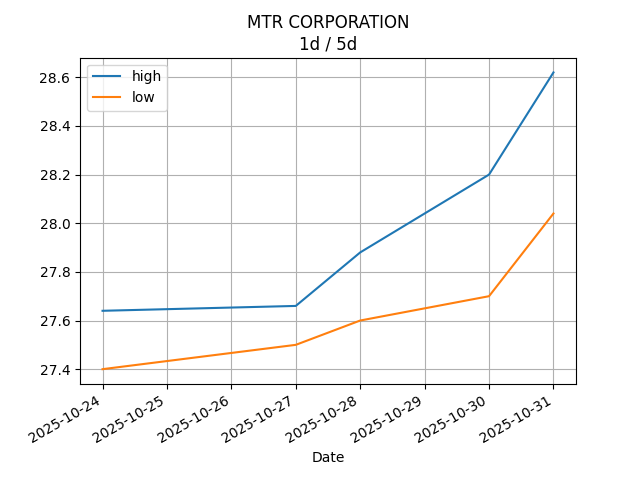

## Net Profit [📈]:
### $5967.60
|type|graph|data|
|:---:|:---:|:---:|
|30m / 1d||<table border="1" class="dataframe"> <thead> <tr style="text-align: center;"> <th>Datetime</th> <th>profit</th> </tr> </thead> <tbody> <tr> <td>01:30</td> <td>5043.6</td> </tr> <tr> <td>02:00</td> <td>5206.6</td> </tr> <tr> <td>02:30</td> <td>5217.6</td> </tr> <tr> <td>03:00</td> <td>5380.6</td> </tr> <tr> <td>03:30</td> <td>5418.6</td> </tr> <tr> <td>04:00</td> <td>5418.6</td> </tr> <tr> <td>04:30</td> <td>5418.6</td> </tr> <tr> <td>05:00</td> <td>5418.6</td> </tr> <tr> <td>05:30</td> <td>5228.6</td> </tr> <tr> <td>06:00</td> <td>5755.6</td> </tr> <tr> <td>06:30</td> <td>5717.6</td> </tr> <tr> <td>07:00</td> <td>5717.6</td> </tr> <tr> <td>07:30</td> <td>5717.6</td> </tr> </tbody></table>|
|1d / 5d||<table border="1" class="dataframe"> <thead> <tr style="text-align: center;"> <th>Date</th> <th>profit</th> </tr> </thead> <tbody> <tr> <td>2025-07-23</td> <td>5434.6</td> </tr> <tr> <td>2025-07-24</td> <td>4521.6</td> </tr> <tr> <td>2025-07-27</td> <td>4733.6</td> </tr> <tr> <td>2025-07-28</td> <td>4690.6</td> </tr> <tr> <td>2025-07-29</td> <td>5929.6</td> </tr> </tbody></table>|
|1wk / 1mo||<table border="1" class="dataframe"> <thead> <tr style="text-align: center;"> <th>Date</th> <th>profit</th> </tr> </thead> <tbody> <tr> <td>2025-06-29</td> <td>4691.6</td> </tr> <tr> <td>2025-07-06</td> <td>2245.6</td> </tr> <tr> <td>2025-07-13</td> <td>2283.6</td> </tr> <tr> <td>2025-07-20</td> <td>4521.6</td> </tr> <tr> <td>2025-07-27</td> <td>5929.6</td> </tr> </tbody></table>|
---
## 002100.SZ [📉] [$-5407.40] [-17.87%]:
#### TECON BIOLOGY Co.LTD
|price|profit|data|
|:---:|:---:|:---:|
|||<table border="1" class="dataframe"> <thead> <tr style="text-align: center;"> <th>Datetime</th> <th>profit</th> </tr> </thead> <tbody> <tr> <td>09:30</td> <td>-5331.4</td> </tr> <tr> <td>10:00</td> <td>-5293.4</td> </tr> <tr> <td>10:30</td> <td>-5407.4</td> </tr> <tr> <td>11:00</td> <td>-5369.4</td> </tr> <tr> <td>11:30</td> <td>-5331.4</td> </tr> <tr> <td>12:00</td> <td>-5331.4</td> </tr> <tr> <td>12:30</td> <td>-5331.4</td> </tr> <tr> <td>13:00</td> <td>-5331.4</td> </tr> <tr> <td>13:30</td> <td>-5521.4</td> </tr> <tr> <td>14:00</td> <td>-5369.4</td> </tr> <tr> <td>14:30</td> <td>-5407.4</td> </tr> </tbody></table>|
|||<table border="1" class="dataframe"> <thead> <tr style="text-align: center;"> <th>Date</th> <th>profit</th> </tr> </thead> <tbody> <tr> <td>2025-07-24</td> <td>-5065.4</td> </tr> <tr> <td>2025-07-25</td> <td>-5103.4</td> </tr> <tr> <td>2025-07-28</td> <td>-5141.4</td> </tr> <tr> <td>2025-07-29</td> <td>-5559.4</td> </tr> <tr> <td>2025-07-30</td> <td>-5445.4</td> </tr> </tbody></table>|
|||<table border="1" class="dataframe"> <thead> <tr style="text-align: center;"> <th>Date</th> <th>profit</th> </tr> </thead> <tbody> <tr> <td>2025-06-30</td> <td>-6433.4</td> </tr> <tr> <td>2025-07-07</td> <td>-6129.4</td> </tr> <tr> <td>2025-07-14</td> <td>-6091.4</td> </tr> <tr> <td>2025-07-21</td> <td>-5103.4</td> </tr> <tr> <td>2025-07-28</td> <td>-5445.4</td> </tr> </tbody></table>|
---
## 0066.HK [📈] [$11375.00] [18.88%]:
#### MTR CORPORATION
|price|profit|data|
|:---:|:---:|:---:|
|||<table border="1" class="dataframe"> <thead> <tr style="text-align: center;"> <th>Datetime</th> <th>profit</th> </tr> </thead> <tbody> <tr> <td>09:30</td> <td>10375.0</td> </tr> <tr> <td>10:00</td> <td>10500.0</td> </tr> <tr> <td>10:30</td> <td>10625.0</td> </tr> <tr> <td>11:00</td> <td>10750.0</td> </tr> <tr> <td>11:30</td> <td>10750.0</td> </tr> <tr> <td>13:00</td> <td>10750.0</td> </tr> <tr> <td>13:30</td> <td>10750.0</td> </tr> <tr> <td>14:00</td> <td>11125.0</td> </tr> <tr> <td>14:30</td> <td>11125.0</td> </tr> <tr> <td>15:00</td> <td>11250.0</td> </tr> <tr> <td>15:30</td> <td>11375.0</td> </tr> </tbody></table>|
|||<table border="1" class="dataframe"> <thead> <tr style="text-align: center;"> <th>Date</th> <th>profit</th> </tr> </thead> <tbody> <tr> <td>2025-07-24</td> <td>10500.0</td> </tr> <tr> <td>2025-07-25</td> <td>9625.0</td> </tr> <tr> <td>2025-07-28</td> <td>9875.0</td> </tr> <tr> <td>2025-07-29</td> <td>10250.0</td> </tr> <tr> <td>2025-07-30</td> <td>11375.0</td> </tr> </tbody></table>|
|||<table border="1" class="dataframe"> <thead> <tr style="text-align: center;"> <th>Date</th> <th>profit</th> </tr> </thead> <tbody> <tr> <td>2025-06-30</td> <td>11125.0</td> </tr> <tr> <td>2025-07-07</td> <td>8375.0</td> </tr> <tr> <td>2025-07-14</td> <td>8375.0</td> </tr> <tr> <td>2025-07-21</td> <td>9625.0</td> </tr> <tr> <td>2025-07-28</td> <td>11375.0</td> </tr> </tbody></table>|
---
