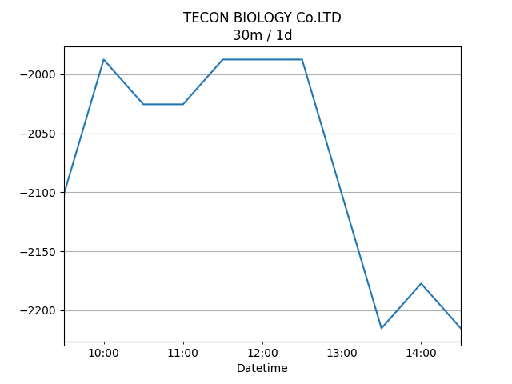

## Net Profit [📈]:
### $4942.60
|type|graph|data|
|:---:|:---:|:---:|
|30m / 1d||<table border="1" class="dataframe"> <thead> <tr style="text-align: center;"> <th>Datetime</th> <th>profit</th> </tr> </thead> <tbody> <tr> <td>01:30</td> <td>5130.6</td> </tr> <tr> <td>02:00</td> <td>5144.6</td> </tr> <tr> <td>02:30</td> <td>5138.6</td> </tr> <tr> <td>03:00</td> <td>4934.6</td> </tr> <tr> <td>03:30</td> <td>4866.6</td> </tr> <tr> <td>04:00</td> <td>4866.6</td> </tr> <tr> <td>04:30</td> <td>4866.6</td> </tr> <tr> <td>05:00</td> <td>4820.6</td> </tr> <tr> <td>05:30</td> <td>4828.6</td> </tr> <tr> <td>06:00</td> <td>4850.6</td> </tr> <tr> <td>06:30</td> <td>5002.6</td> </tr> <tr> <td>07:00</td> <td>5002.6</td> </tr> </tbody></table>|
|1d / 5d||<table border="1" class="dataframe"> <thead> <tr style="text-align: center;"> <th>Date</th> <th>profit</th> </tr> </thead> <tbody> <tr> <td>2025-12-04</td> <td>6628.6</td> </tr> <tr> <td>2025-12-07</td> <td>5366.6</td> </tr> <tr> <td>2025-12-08</td> <td>5080.6</td> </tr> <tr> <td>2025-12-09</td> <td>5464.6</td> </tr> <tr> <td>2025-12-10</td> <td>4942.6</td> </tr> </tbody></table>|
|1wk / 1mo||<table border="1" class="dataframe"> <thead> <tr style="text-align: center;"> <th>Date</th> <th>profit</th> </tr> </thead> <tbody> <tr> <td>2025-11-09</td> <td>8094.6</td> </tr> <tr> <td>2025-11-16</td> <td>6232.6</td> </tr> <tr> <td>2025-11-23</td> <td>7498.6</td> </tr> <tr> <td>2025-11-30</td> <td>6628.6</td> </tr> <tr> <td>2025-12-07</td> <td>4942.6</td> </tr> </tbody></table>|
---
## 002100.SZ [📉] [$-4267.40] [-14.10%]:
#### TECON BIOLOGY Co.LTD
|price|profit|data|
|:---:|:---:|:---:|
|||<table border="1" class="dataframe"> <thead> <tr style="text-align: center;"> <th>Datetime</th> <th>profit</th> </tr> </thead> <tbody> <tr> <td>09:30</td> <td>-4229.4</td> </tr> <tr> <td>10:00</td> <td>-4305.4</td> </tr> <tr> <td>10:30</td> <td>-4191.4</td> </tr> <tr> <td>11:00</td> <td>-4305.4</td> </tr> <tr> <td>11:30</td> <td>-4343.4</td> </tr> <tr> <td>12:00</td> <td>-4343.4</td> </tr> <tr> <td>12:30</td> <td>-4343.4</td> </tr> <tr> <td>13:00</td> <td>-4419.4</td> </tr> <tr> <td>13:30</td> <td>-4381.4</td> </tr> <tr> <td>14:00</td> <td>-4419.4</td> </tr> <tr> <td>14:30</td> <td>-4267.4</td> </tr> </tbody></table>|
|||<table border="1" class="dataframe"> <thead> <tr style="text-align: center;"> <th>Date</th> <th>profit</th> </tr> </thead> <tbody> <tr> <td>2025-12-05</td> <td>-3811.4</td> </tr> <tr> <td>2025-12-08</td> <td>-3963.4</td> </tr> <tr> <td>2025-12-09</td> <td>-4039.4</td> </tr> <tr> <td>2025-12-10</td> <td>-3925.4</td> </tr> <tr> <td>2025-12-11</td> <td>-4267.4</td> </tr> </tbody></table>|
|||<table border="1" class="dataframe"> <thead> <tr style="text-align: center;"> <th>Date</th> <th>profit</th> </tr> </thead> <tbody> <tr> <td>2025-11-10</td> <td>-1265.4</td> </tr> <tr> <td>2025-11-17</td> <td>-3127.4</td> </tr> <tr> <td>2025-11-24</td> <td>-2671.4</td> </tr> <tr> <td>2025-12-01</td> <td>-3811.4</td> </tr> <tr> <td>2025-12-08</td> <td>-4267.4</td> </tr> </tbody></table>|
---
## 0066.HK [📈] [$9210.00] [25.48%]:
#### MTR CORPORATION
|price|profit|data|
|:---:|:---:|:---:|
|||<table border="1" class="dataframe"> <thead> <tr style="text-align: center;"> <th>Datetime</th> <th>profit</th> </tr> </thead> <tbody> <tr> <td>09:30</td> <td>9360.0</td> </tr> <tr> <td>10:00</td> <td>9450.0</td> </tr> <tr> <td>10:30</td> <td>9330.0</td> </tr> <tr> <td>11:00</td> <td>9240.0</td> </tr> <tr> <td>11:30</td> <td>9210.0</td> </tr> <tr> <td>13:00</td> <td>9240.0</td> </tr> <tr> <td>13:30</td> <td>9210.0</td> </tr> <tr> <td>14:00</td> <td>9270.0</td> </tr> <tr> <td>14:30</td> <td>9270.0</td> </tr> <tr> <td>15:00</td> <td>9210.0</td> </tr> </tbody></table>|
|||<table border="1" class="dataframe"> <thead> <tr style="text-align: center;"> <th>Date</th> <th>profit</th> </tr> </thead> <tbody> <tr> <td>2025-12-05</td> <td>10440.0</td> </tr> <tr> <td>2025-12-08</td> <td>9330.0</td> </tr> <tr> <td>2025-12-09</td> <td>9120.0</td> </tr> <tr> <td>2025-12-10</td> <td>9390.0</td> </tr> <tr> <td>2025-12-11</td> <td>9210.0</td> </tr> </tbody></table>|
|||<table border="1" class="dataframe"> <thead> <tr style="text-align: center;"> <th>Date</th> <th>profit</th> </tr> </thead> <tbody> <tr> <td>2025-11-10</td> <td>9360.0</td> </tr> <tr> <td>2025-11-17</td> <td>9360.0</td> </tr> <tr> <td>2025-11-24</td> <td>10170.0</td> </tr> <tr> <td>2025-12-01</td> <td>10440.0</td> </tr> <tr> <td>2025-12-08</td> <td>9210.0</td> </tr> </tbody></table>|
---
