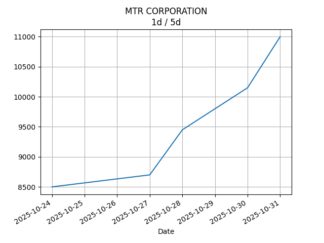

## Net Profit [📈]:
### $1180.60
|type|graph|data|
|:---:|:---:|:---:|
|30m / 1d||<table border="1" class="dataframe"> <thead> <tr style="text-align: center;"> <th>Datetime</th> <th>profit</th> </tr> </thead> <tbody> <tr> <td>01:30</td> <td>1394.6</td> </tr> <tr> <td>02:00</td> <td>1180.6</td> </tr> </tbody></table>|
|1d / 5d||<table border="1" class="dataframe"> <thead> <tr style="text-align: center;"> <th>Date</th> <th>profit</th> </tr> </thead> <tbody> <tr> <td>2025-09-01</td> <td>764.6</td> </tr> <tr> <td>2025-09-02</td> <td>-205.4</td> </tr> <tr> <td>2025-09-03</td> <td>-3.4</td> </tr> <tr> <td>2025-09-04</td> <td>722.6</td> </tr> <tr> <td>2025-09-07</td> <td>1180.6</td> </tr> </tbody></table>|
|1wk / 1mo||<table border="1" class="dataframe"> <thead> <tr style="text-align: center;"> <th>Date</th> <th>profit</th> </tr> </thead> <tbody> <tr> <td>2025-08-03</td> <td>3666.99</td> </tr> <tr> <td>2025-08-10</td> <td>1472.30</td> </tr> <tr> <td>2025-08-17</td> <td>1872.14</td> </tr> <tr> <td>2025-08-24</td> <td>-426.28</td> </tr> <tr> <td>2025-08-31</td> <td>722.60</td> </tr> </tbody></table>|
---
## 002100.SZ [📉] [$-4419.40] [-14.61%]:
#### TECON BIOLOGY Co.LTD
|price|profit|data|
|:---:|:---:|:---:|
|||<table border="1" class="dataframe"> <thead> <tr style="text-align: center;"> <th>Datetime</th> <th>profit</th> </tr> </thead> <tbody> <tr> <td>09:30</td> <td>-4305.4</td> </tr> <tr> <td>10:00</td> <td>-4419.4</td> </tr> </tbody></table>|
|||<table border="1" class="dataframe"> <thead> <tr style="text-align: center;"> <th>Date</th> <th>profit</th> </tr> </thead> <tbody> <tr> <td>2025-09-02</td> <td>-4685.4</td> </tr> <tr> <td>2025-09-03</td> <td>-5255.4</td> </tr> <tr> <td>2025-09-04</td> <td>-5103.4</td> </tr> <tr> <td>2025-09-05</td> <td>-5027.4</td> </tr> <tr> <td>2025-09-08</td> <td>-4419.4</td> </tr> </tbody></table>|
|||<table border="1" class="dataframe"> <thead> <tr style="text-align: center;"> <th>Date</th> <th>profit</th> </tr> </thead> <tbody> <tr> <td>2025-08-04</td> <td>-5255.4</td> </tr> <tr> <td>2025-08-11</td> <td>-5825.4</td> </tr> <tr> <td>2025-08-18</td> <td>-5179.4</td> </tr> <tr> <td>2025-08-25</td> <td>-5065.4</td> </tr> <tr> <td>2025-09-01</td> <td>-5027.4</td> </tr> </tbody></table>|
---
## 0066.HK [📈] [$5600.00] [9.29%]:
#### MTR CORPORATION
|price|profit|data|
|:---:|:---:|:---:|
|||<table border="1" class="dataframe"> <thead> <tr style="text-align: center;"> <th>Datetime</th> <th>profit</th> </tr> </thead> <tbody> <tr> <td>09:30</td> <td>5700.0</td> </tr> <tr> <td>10:00</td> <td>5600.0</td> </tr> </tbody></table>|
|||<table border="1" class="dataframe"> <thead> <tr style="text-align: center;"> <th>Date</th> <th>profit</th> </tr> </thead> <tbody> <tr> <td>2025-09-02</td> <td>5450.0</td> </tr> <tr> <td>2025-09-03</td> <td>5050.0</td> </tr> <tr> <td>2025-09-04</td> <td>5100.0</td> </tr> <tr> <td>2025-09-05</td> <td>5750.0</td> </tr> <tr> <td>2025-09-08</td> <td>5600.0</td> </tr> </tbody></table>|
|||<table border="1" class="dataframe"> <thead> <tr style="text-align: center;"> <th>Date</th> <th>profit</th> </tr> </thead> <tbody> <tr> <td>2025-08-04</td> <td>8922.39</td> </tr> <tr> <td>2025-08-11</td> <td>7297.70</td> </tr> <tr> <td>2025-08-18</td> <td>7051.54</td> </tr> <tr> <td>2025-08-25</td> <td>4639.12</td> </tr> <tr> <td>2025-09-01</td> <td>5750.00</td> </tr> </tbody></table>|
---
